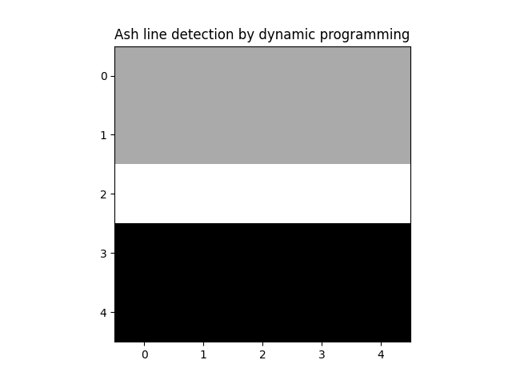
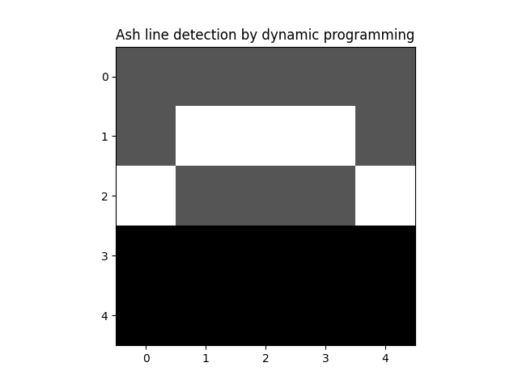
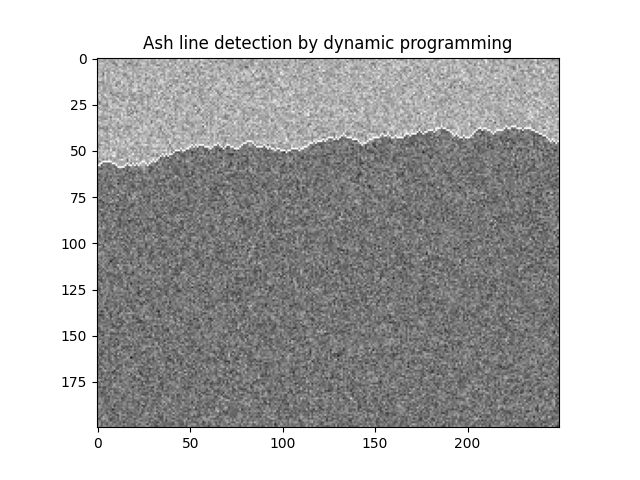
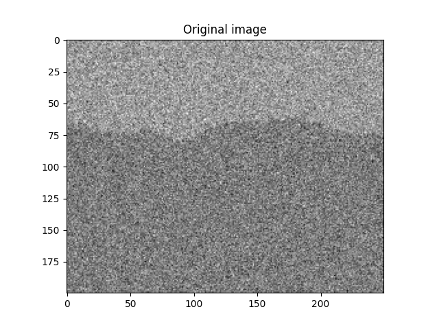
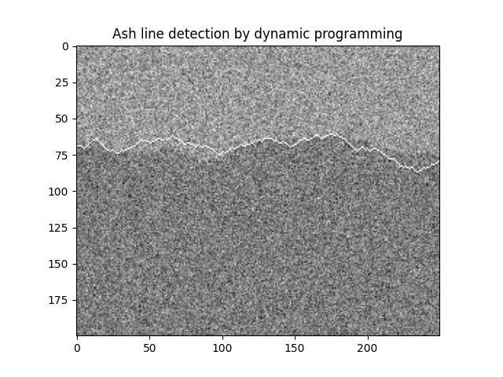

# Dynamic Programming

I learned the term _dynamic programming_ during my master thesis work. 

It was a long time ago, and my work was in the field of image processing.

I called it image processing, but it was also referred to as computer vision. Neural networks were there, but not yet used for computer vision.

To be more precise, the goal was to process images, from inside an industrial furnace, with the goal of establishing the boundary between a light region 
and a dark region.

The light region was there because of fire (it was a bark furnace, used for generation of heat, and perhaps electricity), and the dark region was where
there was no fire.

We used the term _ash line_ for the boundary between the light region and the dark region.

We assumed that the ash line, if it could be detected, would divide the image in two halves - an upper and a lower half.

Having established the position of the ash line, across an image, the next goal was to control the burning in the furnace so that the 
ash line became located at a desired position. This was not done in my master thesis, where the goal was to locate the ash line.

As a first approach, I tried different ways of segmenting the image, using methods such as thresholding, or finding a boundary using 
image gradients.

This worked well for some images, and not so well for others.

About halfway in to the work, my thesis advisor proposed that I should try dynamic programming.

I had no clue what was meant with those words.

I got a reference to a
[book chapter](https://homepages.inf.ed.ac.uk/rbf/BOOKS/BANDB/bandb.htm){target="_blank"},
where the usage of dynamic programming for image processing was described.

## Optimization with application to image processing

With reference to the master thesis work, we can construct a simple example.

We can imagine an 5 by 5 image, with 25 pixels with image values, as

```
3 3 3 3 3
3 3 3 3 3
3 3 3 3 3
1 1 1 1 1
1 1 1 1 1
```

The values in the above image represent light intensity. 

This means that a higher value represents a lighter pixel.

In the image above, we see that the first three rows of the image are lighter than the bottom two rows.

We can represent the ash line as a sequence of values defining, per column, on which row the ash line is located.

The dynamic programming method used in the master thesis did an optimization, where the result of the optimization
gave one value per column, indicating the best choice of row where the ash line would be located.

For the purpose of optimization, we need a function that we can minimize (or maximize).

In dynamic programming, one typically minimizes a sum, like

$$
\sum_{k=0}^{N} g(x_k)
$$

For the purpose of finding the ash line, we can think of $k$ in the above formula as a column index. 

We have $N+1$ terms in the sum, meaning that we think of the image as having $N+1$ columns.

For each column $k$, we shall pick a value $x_k$, indicating the row where the ash line is located.

One might wonder what a good choice for the function $g$ could be?

One idea is to let $g$ represent the _gradient_ in the image. The gradient in an image defines, for each pixel, how much the intensity is
changing at that pixel.

For simplicity, we could think of a gradient only in the vertical direction, computed as the difference between 
the image value at one pixel and the image value at the pixel immediately below.

A high value would then indicate that the pixel is lighter than the pixel below it. 

Pixels with high values for this gradient could perhaps be good candidates for pointing out where the ash line is located.

If so, we could perhaps find the ash line by maximizing a function $V(x_0, \ldots, x_N)$, as 
$$
\max_{x_0, \ldots, x_N} V(x_0, \ldots, x_N) = \max_{x_0, \ldots, x_N} \sum_{k=0}^N g(x_k)
$$
From the form of this maximization, and as a consequence of our choice of using only the vertical gradient, 
which means that the gradient at pixel $x_i$ is indepedent of the 
gradient at pixel $x_j$ when $i \ne j$, we see that the 
choice of a given variable, e.g. $x_i$, does not influence
how we should choose another variable, e.g $x_j$.

In other words, we can maximize each of the terms $g(x_i)$ separately.

The total maximum would then be the sum of these maximum values.

For the image above, with the function $g$ chosen as the vertical gradient, we see that the optimal location 
of the ash line is between the third and the fourth rows.

Using parentheses to indicate the pixels where the ash line is located, we can illustrate this as

```
 3   3   3   3   3
 3   3   3   3   3
(3) (3) (3) (3) (3)
 1   1   1   1   1
 1   1   1   1   1
```

We see that for this example, with the function to maximize as chosen above, 
the optimization is rather trivial (and dynamic programming is not needed).

We also see that for another image, as

```
3 3 9 3 3
3 3 3 3 3
3 3 3 3 3
1 1 1 1 1
1 1 1 1 1
```

the optimization would result in an ash line location, as

```
 3   3  (9)  3   3
 3   3   3   3   3
(3) (3)  3  (3) (3)
 1   1   1   1   1
 1   1   1   1   1
```

Depending on how we interpret the pixel value 9, in the first row, we might consider this

- a good solution (if the ash line is really taking a "jump" upwards in the third column)
- a bad solution (if the value 9 is the result of a noisy pixel, and should therefore be ignored)

If we stick with the second of the above two bullets, we might want to consider some filtering of the image, 
before doing the optimization.

As an alternative, we could define another function for our optimization.

If we do this, we might want to know how dynamic programming can be beneficial!

And we could take this as motivation for reading also the rest of this post.

## Optimization as a sequential decision problem

In the optimization problem stated above, our task is to choose the values $x_0, \ldots x_N$.

We can think of choosing these values as of choosing them in sequence. 

This means that we start with choosing $x_0$. Then we choose $x_1$.
From there, we proceed with choosing $x_2$, followed by $x_3$, until we have chosen 
the final value $x_N$.

For the problem as stated above, a decision, in this sequence, at a certain time, does not have any _consequences_ for
which decisions that are good to make at later times.

The reason for this is that we can choose the values for each image column independently.

Dynamic programming is a methodology that is useful when we, as a contrast, have a sequential decision problem where the decision at one time instant
_has_ consequences for which decisions that are best to make at later time instants.

On example could be that we need to choose a way to travel between two cities, with the goal of finding the shortest route 
for our journey.

If we, in such a scenario, decide, at a certain crossing, to turn left or right, 
this might have consequences for the resulting length of our journey. 

Turning left may, for example, lead us to a place from where the shortest route to our destination is 100 kilometers.

On the other hand, if we had turned right, we could have ended up in a place from where the shortest route to our destination is only 
75 kilometers.

So the action of turning left, or turning right, has consequences for which optimal value (which shortest route) we can achieve.

## Dynamic programming with application in image processing

We can add a constraint to our choice of ash line, stating that when moving from one column $k$ to the 
column $k+1$ (the column to the right), the ash line can only move at most one pixel up or down.

This constraint will put a limit on the slope of the ash line.

Note that even with this added constraint, we want to find an ash line that has a high gradient. 

We can formulate our choosing of ash line, with the added constraint, as a decision problem where we, 
for each column, choose how to "move" when going to the next column.

We can either

- move up, meaning that the ash line at column $k+1$ is on the row above the row chosen at colum $k$
- not move, meaning that the ash line at column $k+1$ is on the same row as the row chosen at colum $k$
- move down, meaning that the ash line at column $k+1$ is on the row below the row chosen at colum $k$

We can use a variable $u$ to indicate our decisions. We can define $u(k)$, for each column $k$ except the last column, as

- $u(k) = -1$ when moving up
- $u(k) = 0$ when not moving
- $u(k) = 1$ when moving down

Given a value $x_k$, indicating, for column $k$, the row on which the ash line is located, choosing $u$ then gives, 
using the convention that the topmost row has the lowest row number, that

- $x_{k+1} = x_k - 1$ if we choose $u(k) = -1$
- $x_{k+1} = x_k$ if we choose $u(k) = 0$
- $x_{k+1} = x_k + 1$ if we choose $u(k) = 1$

The above three bullets represent a functional relation that defines, for given values $x_k$ and $u_k$, the resulting value of $x_{k+1}$.

We note that the relation is only defined for $u = -1$, $u = 0$, and $u=1$. 

Defining an _admissible set_ 
$$
U=\{-1, 0, 1\}
$$
we can say that the three bullets represent a functional relation
$$
x_{k+1} = f(x_k, u_k), \quad u_k \in U
$$
From the expressions for $x_{k+1}$, as stated in the three bullets above, we get an explicit representation for $f$, as
$$
x_{k+1} = x_k + u_k, \quad u_k \in U
$$
We refer to a functional relation of this type as a _dynamic system_.

We say that the dynamic system has a _state variable_ $x$, which for each time step $k$ depends on the 
value it had at the previous time step, combined with the value chosen for $u$ at that time step.

We refer to $u$ as the _control signal_. 

The control signal determines (controls) how the state of the dynamic system will evolve.

Returning to our original optimization problem
$$
\max_{x_0, \ldots, x_N} V(x_0, \ldots, x_N) = \max_{x_0, \ldots, x_N} \sum_{k=0}^N g(x_k)
$$
we can now, as an alternative formulation, say that instead of choosing values $x_k$, we choose values $u_k$, which then, 
using the dynamic system shown above result in values for the next state $x_{k+1}$.

We assume an initial state value $x_0$.

The optimization problem shall then help us finding, as a first step, $u_0$, giving us $x_1$. 
Then we shall find $u_1$, giving us $x_2$, and so on, up to and including the choice of $u_{N-1}$, which gives us $x_N$.

We shall do this optimization for all possible values of $x_0$.

We reformulate the optimization problem as
$$
\max_{u_0, \ldots, u_{N-1}} V(x_0, \ldots, x_N) = \max_{u_0, \ldots, u_{N-1}} \sum_{k=0}^N g(x_k)
$$
where the $x_k$ values are constrained by the dynamic system
$$
x_{k+1} = f(x_k, u_k), \quad u_k \in U, \quad k = 0, \ldots, N-1
$$

## Formulating a dynamic programming problem

When doing dynamic programming, we can proceed by first writing the function $V$ as
$$
V(x_0, \ldots, x_N) = \sum_{k=0}^N g(x_k) = g(x_0) + \sum_{k=1}^N g(x_k)
$$
Doing maximization gives
$$
\max_{u_0, \ldots, u_{N-1}} V(x_0, \ldots, x_N) = \max_{u_0, \ldots, u_{N-1}} \sum_{k=0}^N g(x_k) = \max_{u_0, \ldots, u_{N-1}} [g(x_0) + \sum_{k=1}^N g(x_k)]
$$
Consider also maximizing a _subproblem_, consisting of choosing $u$-values $u_1, \ldots, u_{N-1}$, as 
$$
\max_{u_1, \ldots, u_{N-1}} \sum_{k=1}^N g(x_k)
$$
We might be able to convince ourselves that this subproblem can be used when solving the original problem, 
by rewriting the original problem as
$$
\max_{u_0, \ldots, u_{N-1}} V(x_0, \ldots, x_N) = \max_{u_0, \ldots, u_{N-1}} [g(x_0) + \sum_{k=1}^N g(x_k)] = 
\max_{u_0}[g(x_0) + \max_{u_1, \ldots, u_{N-1}} \sum_{k=1}^N g(x_k)]
$$
In the same way, we can rewrite the subproblem starting at $x_1$
$$
\max_{u_1, \ldots, u_{N-1}} \sum_{k=1}^N g(x_k)
$$
using a subproblem starting at $x_2$, as
$$
\max_{u_1, \ldots, u_{N-1}} V(x_1, \ldots, x_N) = \max_{u_1, \ldots, u_{N-1}} [g(x_1) + \sum_{k=2}^N g(x_k)] =
\max_{u_1}[g(x_1) + \max_{u_2, \ldots, u_{N-1}} \sum_{k=2}^N g(x_k)]
$$

Introducing the notation
$$
J_k(x_k) = \max_{u_k, \ldots, u_{N-1}} V(x_k, \ldots, x_N) = \max_{u_k, \ldots, x_{N-1}} \sum_{k=1}^N g(x_k)
$$
we arrive at a recurrence relation
$$
J_k(x_k) = \max_{u_k}[g(x_k) + J_{k+1}(x_{k+1})]
$$
with the boundary condition
$$
J_N(x_N) = V(x_N) = g(x_N)
$$
We also see that the original problem is found as
$$
J_0(x_0) = \max_{u_0, \ldots, u_{N-1}} V(x_0, \ldots, x_N) = \max_{x_0}[g(x_0) + J_{1}(x_1)]
$$
which is equivalently written using our original formulation as
$$
J_0(x_0) = \max_{x_0, \ldots, u_{N-1}} V(x_0, \ldots, x_N) = \max_{x_0, \ldots, u_{N-1}} \sum_{k=0}^N g(x_k)
$$

## Solving a dynamic programming problem

We start with tabulating the possible values of 
$$
J_N(x_N) = g(x_N)
$$
Then, for each value of $x_{N-1}$, we compute
$$
J_{N-1}(x_{N-1}) = \max_{u_{N-1}}[g(x_{N-1}) + J_{N}(x_N)]
$$
We proceed, with computing, for each value of $x_{N-2}$, the quantity
$$
J_{N-2}(x_{N-2}) = \max_{u_{N-2}}[g(x_{N-2}) + J_{N-1}(x_{N-1})]
$$
Continuing, we arrive at computing, for each value of $x_1$, the quantity
$$
J_{1}(x_{1}) = \max_{u_{1}}[g(x_{1}) + J_{2}(x_{2})]
$$
As the final step, we compute, for each value of $x_0$, the quantity
$$
J_{0}(x_{0}) = \max_{u_{0}}[g(x_{0}) + J_{1}(x_{1})]
$$
At this, final, step, we note for which $x_0$, we obtained the maximum value of $J_0(x_0)$.

For this $x_0$, we note the value of $u(0)$ that gave the maximum of $J_0(x_0)$.

This is the optimal, first, value of the control signal. 

We note that the computations done so far have been done by moving, from the final state $x_N$, _backwards_ in time, towards the initial 
state $x_0$.

Using the optimal $u_0$, and the corresponding optimal $x_0$, we can find the optimal $x_1$.

From the optimization that we did for $x_1$, i.e. when we computed $J_{1}(x_{1})$, we note which $u_1$ that gave the 
optimum value of $J_{1}(x_{1})$.

From this value of $u_1$, we can find the optimal $x_2$, and using that value, we note for which value of $u_2$ that we got the optimal
value for $J_{2}(x_{2})$.

Proceeding like this, now moving _forward_ in time, we find the optimal control sequence
$$
u_0, \ldots, u_{N-1}
$$
as well as the corresponding optimal state sequence
$$
x_0, \ldots, x_{N}
$$
From our computations backwards in time, we have also found the optimal loss function sequence
$$
J_{0}(x_{0}), \ldots, J_{N}(x_{N})
$$

## Solving the dynamic programming for finding the ash line

We modify our example image, to make the optimization a bit more challenging.

The modified image is

```
3 3 3 3 3
3 6 5 6 3
3 3 3 3 3
1 1 1 1 1
1 1 1 1 1
```

We index rows and columns starting with index 0, and with row 0 and column 0 as the upper left corner.

We use $R$ to denote the number of rows and $C$ to denote the number of columns. 

For the example image, we have $R=5$ and $C=5$.

We use the notation $h(x_i)$ to denote the actual pixel value at $x_i$, i.e. at column $i$ and row $x_i$.

This leads to a function $g(x_i)$, defined, for $0 \le x_i < R$ and $0 \le i < C$  as 
$$
g(x_i) = h(x_i) - h(x_i+1)
$$

Using this gradient function on our modified example image results in

```
0 -3 -2 -3  0
0  3  2  3  0
2  2  2  2  2
0  0  0  0  0
-  -  -  -  -
```

Our solution method for dynamic programming, as described above, says that we shall start with computing, for each $x_N$,
$$
J_N(x_N) = g(x_N)
$$
Noting that $N=C-1=4$, we can make a table of this quantity, as

::: {.table-narrow style="width: 30%; margin: auto;"}

| $x_4$  | $J_4(x_4)$ |      
|--------|-----------|
| 0      | 0         |
| 1      | 0         |
| 2      | 2         |
| 3      | 0         |
| 4      | -         |

:::

Continuing the solution approach described above, we shall now compute

$$
J_{N-1}(x_{N-1}) = \max_{u_{N-1}}[g(x_{N-1}) + J_{N}(x_N)]
$$

which, using $N=4$, becomes
$$
J_3(x_3) = \max_{u_3}[g(x_3) + J_{4}(x_{4})]
$$

When doing this computation, we also need to take into account the limitation 
on $u_k$, that it can only take on the values in the admissible set
$$
U=\{-1, 0, 1\}
$$
which, as we saw above, means that the ash line can take at most one step upwards, or downwards, when 
moving from one colum to the next column (the column on the right).

The result is that the values of $x_4$ that we consider, in the computation of $J_3(x_3)$ are
$x_3-1$, $x_3$, and $x_3+1$

As an additional notational aid, we use the notation $u_3^*$, for the value of $u_3$ that 
gives the maximum value in the computation of $J_3(x_3)$.

With this in mind, we can illustrate the computation of $J_3(x_3)$ in a table, as

::: {.table-narrow style="width: 70%; margin: auto;"}

| $x_3$  | $g(x_3)$ | $J_4(x_3-1)$ | $J_4(x_3)$ | $J_4(x_3+1)$ | $J_3(x_3)$ | $u_3^*$ |
|--------|----------|--------------|------------|--------------|----------|---------|
| 0      | -3       | -            | 0          | 0            | -3       | 0,1     |
| 1      |  3       | 0            | 0          | 2            | 5        | 1       |
| 2      |  2       | 0            | 2          | 0            | 4        | 0       |
| 3      |  0       | 2            | 0          | -            | 2        | -1      |
| 4      |  -       | 0            | -          | -            | 0        | -1      |

:::

We can continue, and compute $J_2(x_2)$, as
$$
J_2(x_2) = \max_{u_2}[g(x_2) + J_{3}(x_{3})]
$$
by filling in a similar table as the one above, as

::: {.table-narrow style="width: 70%; margin: auto;"}

| $x_2$  | $g(x_2)$ | $J_3(x_2-1)$ | $J_3(x_2)$ | $J_3(x_2+1)$ | $J_2(x_2)$ | $u_2^*$ |
|--------|----------|--------------|------------|--------------|----------|---------|
| 0      | -2       | -            | -3         | 5            | 3        | 1       |
| 1      |  2       | -3           | 5          | 4            | 7        | 0       |
| 2      |  2       | 5            | 4          | 2            | 7        | -1      |
| 3      |  0       | 4            | 2          | 0            | 4        | -1      |
| 4      |  -       | 2            | 0          | -            | 2        | -1      |

:::

For the next iteration, we compute

$$
J_1(x_1) = \max_{u_1}[g(x_1) + J_{2}(x_{2})]
$$
with a table, as

::: {.table-narrow style="width: 70%; margin: auto;"}

| $x_1$  | $g(x_1)$ | $J_2(x_1-1)$ | $J_2(x_1)$ | $J_2(x_1+1)$ | $J_1(x_1)$ | $u_1^*$ |
|--------|----------|--------------|------------|--------------|----------|---------|
| 0      | -3       | -            | 3          | 7            | 4        | 1       |
| 1      |  3       | 3            | 7          | 7            | 10       | 0, 1    |
| 2      |  2       | 7            | 7          | 4            | 9        | -1, 0   |
| 3      |  0       | 7            | 4          | 2            | 7        | -1      |
| 4      |  -       | 4            | 2          | -            | 4        | -1      |

:::

As our final calculation, we compute

$$
J_0(x_0) = \max_{u_1}[g(x_1) + J_{1}(x_{1})]
$$
with a table, as

::: {.table-narrow style="width: 70%; margin: auto;"}

| $x_0$  | $g(x_0)$ | $J_1(x_0-1)$ | $J_1(x_0)$ | $J_1(x_0+1)$ | $J_0(x_0)$ | $u_0^*$ |
|--------|----------|--------------|------------|--------------|------------|---------|
| 0      | 0        | -            | 4          | 10           | 10         | 1       |
| 1      | 0        | 4            | 10         | 9            | 10         | 0       |
| 2      | 2        | 10           | 9          | 7            | 12         | -1      |
| 3      | 0        | 9            | 7          | 4            | 9          | -1      |
| 4      | -        | 7            | 4          | -            | 7          | -1      |

:::

We see that the maximum value of $J(x_0)$ occurs for $x_0=2$.

The value $u_0*=-1$ then gives $x_1 = 1$.

Looking in the table where the leftmost column is $x_1$, we see that $u_1^*=0$ or
$u_1^*=1$. 

This gives two alternatives for $x_2$, as $x_2=1$ or $x_2=2$

Looking in the table where the leftmost column is $x_2$, we see that $x_2=1$ gives
$u_2^*=0$ and $x_2=2$ gives $u_2^*=-1$.

Both of these choices lead to $x_3=1$.

Looking in the table where the leftmost column is $x_3$, we see that $x_3=1$ gives
$u_3^*=1$.

This gives $x_4=2$.

To summarize, we have two optimal solutions, given by
$$
x_0=2, x_1=1, x_2=1, x_3=1, x_4=2
$$
with optimal control signal
$$
u_0^*=-1, u_1^*=0, u_2^*=0, u_3^*=1
$$
and
$$
x_0=2, x_1=1, x_2=2, x_3=1, x_4=2
$$
with optimal control signal
$$
u_0^*=-1, u_1^*=1, u_2^*=0, u_3^*=1
$$
Both give the optimal value $J(x_0)=12$.

Indicating the optimal solutions in our image gives

```
 3   3   3   3   3
 3  (6) (5) (6)  3
(3)  3   3   3  (3)
 1   1   1   1   1
 1   1   1   1   1 
```

and

```
 3   3   3   3   3
 3  (6)  5  (6)  3
(3)  3  (3)  3  (3)
 1   1   1   1   1
 1   1   1   1   1 
```

## Python implementation of dynamic programming for ash line detection

A Python implementation of the dynamic programming algorithm, as described above, with application to ash line detection, has been done.

The implmentation uses `numpy` and `matplotlib`.

The image is represented by a class
```python
class Image:
    def __init__(self, n_rows, n_cols):
        self.n_rows = n_rows
        self.n_cols = n_cols
        self.arr = np.zeros([self.n_rows, self.n_cols])

    def set_values(self, values):
        assert values.shape == (self.n_rows, self.n_cols)
        self.arr = values

    def set_value(self, row, col, value):
        self.arr[row, col] = value

    def get_value(self, row, col):
        return self.arr[row, col]

    def set_with_border(self, m_above, std_above, m_below, std_below):
        # the border is the ash line, that we want to detect with DP
        border = []
        # random start row for the border
        r = np.random.randint(int(0.25 * self.n_rows), int(0.75 * self.n_rows))
        border.append(r)
        # remaining row values for the border
        for i in range(1, self.n_cols):
            # a ranom control signal, in the admissible set [-1, 0, 1]
            u = np.random.randint(0, 3)
            u -= 1
            x_i = border[-1]
            x_i = x_i + u
            border.append(x_i)
        # generate pixel values, with different means and standard deviations
        # for pixels above and below the border
        for r in range(self.n_rows):
            for c in range(self.n_cols):
                if r <= border[c]:
                    value = np.random.normal(loc=m_above, scale=std_above)
                else:
                    value = np.random.normal(loc=m_below, scale=std_below)
                self.arr[r][c] = value

    def show(self, title, v_max):
        plt.imshow(self.arr, cmap="gray", vmax=v_max)
        plt.title(title)
        plt.show()
```

The dynamic programming calculations are implemented in a class `DynProg`, with a constructor taking an image as parameter, as

```python
class DynProg:

    def __init__(self, image):
        self.image = image
```

The vertical gradient is calculated by a member function, as

```python
    def g(self, x_i, i):
        if x_i >= self.image.n_rows - 1:
            return 0
        grad = self.image.get_value(x_i, i) - self.image.get_value(x_i + 1, i)
        return grad

```

The dynamic programming calculations are done in a member function `solve`, as

```python
    def solve(self):
        N = self.image.n_cols - 1
        n_x_i = self.image.n_rows
        J_mat = np.zeros([n_x_i, N + 1])
        u_mat = np.zeros([n_x_i, N])
        u_values = np.array([-1, 0, 1])
        # fill in the last column of the J matrix
        for x_i in range(n_x_i):
            J_mat[x_i, -1] = self.g(x_i, N)
        # fill in the remaining columns, from right to left
        for k in range(N - 1, -1, -1):
            for x_i in range(n_x_i):
                # three values, one for each next state, with each of these
                # corresponding to one of the three control signal values -1, 0, and 1
                J_k_plus_1 = np.zeros(3)
                # the gradient
                g_x_i = self.g(x_i, k)
                # u = -1
                if x_i > 0:
                    J_k_plus_1[0] = J_mat[x_i - 1, k + 1]
                # u = 0
                J_k_plus_1[1] = J_mat[x_i, k + 1]
                # u = -1
                if x_i < n_x_i - 1:
                    J_k_plus_1[2] = J_mat[x_i + 1, k + 1]
                value_vec = g_x_i + J_k_plus_1
                # calculate the best u (there might be more than one, but we let argmax pick one)
                u_opt_index = np.argmax(value_vec)
                # the optimal J value
                J_k_value = value_vec[u_opt_index]
                # store optimal J value
                J_mat[x_i, k] = J_k_value
                # store optimal control signal
                u_mat[x_i, k] = u_values[u_opt_index]
        self.J_mat = J_mat
        self.u_mat = u_mat
```

For the purpose of presentation, the solution calculated by dynamic programming can be visualised, by 
setting the pixel values corresponding to the dynamic programming solution to a specified value.

By setting these pixels to a specified value, e.g. a value higher than any other pixel in the image, the 
calculated ash line can be visualised.

The function for setting the pixels corresponding to the dynamic programming solutin is defined as

```python
    def mark_solution_in_image(self, mark_value):
        # the optimal solution starts at the best x_0
        x_0 = np.argmax(self.J_mat[:, 0])
        # the optimal control signal for x_0
        u = int(self.u_mat[x_0, 0])
        x_i = x_0
        # mark solution for first column
        self.image.set_value(x_i, 0, mark_value)
        for i in range(1, self.J_mat.shape[1]):
            x_i = x_i + u
            # mark solution for this x_i value
            self.image.set_value(x_i, i, mark_value)
            # no control signal defined for the rightmost column
            if i < self.J_mat.shape[1] - 1:
                u = int(self.u_mat[x_i, i])
```

## Using the Python implementation

For our first example image, where the optimal value was found by inspection, as

```
 3   3   3   3   3
 3   3   3   3   3
(3) (3) (3) (3) (3)
 1   1   1   1   1
 1   1   1   1   1
```

we visualize the dynamic programming solution, as



For our second example image, where the optimal value was found by dynamic programming, as

```
 3   3   3   3   3
 3  (6) (5) (6)  3
(3)  3   3   3  (3)
 1   1   1   1   1
 1   1   1   1   1 
```

we visualize the dynamic programming solution, as



An image with a randomly selected ash line, and pixels above and below
the ash line having values drawn from a normal distribution with standard deviation 15, and mean value
100 above the ash line and 65 below the ash line, is shown as


Using the Python implementation of dynamic programming described above gives the ash line, as



We can make the situation a bit more challenging, by choosing the mean value below the ash line as 85 (instead of 65), 
and keeping the mean value above the ash line as 100 and the standard deviations at 15.

This gives an image, as



with a dynamic programming result, as



## What do the control guys say?

The above description of dynamic programming was inspired by books and other material, such as slides, from
[Prof. Dimitri Bertsekas](https://web.mit.edu/dimitrib/www/home.html){target="_blank"}.

Dynamic programming, presented in this way, originates from the works of 
[Richard Bellman](https://en.wikipedia.org/wiki/Richard_E._Bellman){target="_blank"}.

## How can we relate to dynamic programming as used in computer science?

Dynamic programming is a term also used in computer science. 

For a description, covering also the control-oriented approach, the
[Wikipedia article](https://en.wikipedia.org/wiki/Dynamic_programming){target="_blank"} could be a good starting point.

## Where to go from here

The purpose of this post was to describe dynamic programming as is often done in control oriented literature.

A simple loss function, based on the vertical gradient, was used, and illustrated in some examples.

One can of course use a more elaborate loss function (or use machine learning, or any other method of choice).

In future blog posts, I will try to illustrate how dynamic programming, as described in this post, can be applied to 
different problems.

